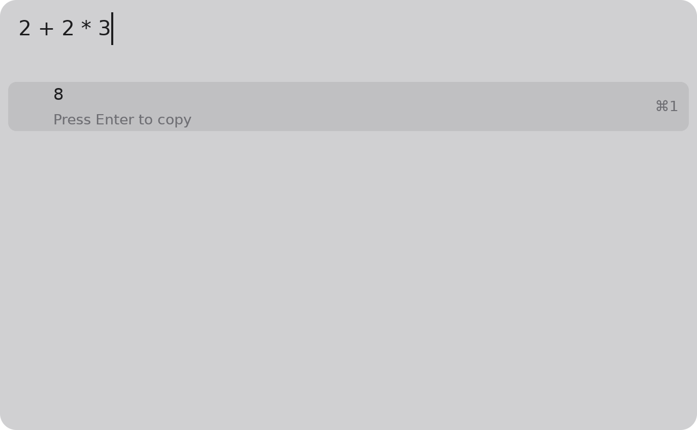

---
hide:
  - navigation
  - toc
---

# cmd

**A launcher for macOS in the place of Spotlight.** Press a key, type, and the answer is
there: arithmetic, a web search, a file, an app, a system command. Everything it finds
comes from plugins, and a plugin is a small Python program anyone can write.

{ width="640" }

-   :material-keyboard-outline:{ .lg .middle } **Use cmd**

    ---

    Install the app, press ++option+space++, start typing. Add plugins from the index
    with one command.

    [:octicons-arrow-right-24: Getting started](use/index.md)

-   :material-language-python:{ .lg .middle } **Write a plugin**

    ---

    Three files and a function that turns text into rows. The SDK speaks the protocol;
    you write the plugin.

    [:octicons-arrow-right-24: A plugin in ten minutes](plugins/tutorial.md)

-   :material-language-rust:{ .lg .middle } **Work on the core**

    ---

    A pure Rust core, a plugin host, and a GPUI window. How it fits together and how a
    change gets in.

    [:octicons-arrow-right-24: For core contributors](core/index.md)

!!! warning "Early days"
    cmd is in its second milestone. It runs on Apple silicon Macs, is built by CI on every
    push, and is not yet signed or packaged for Homebrew. The [board](core/process.md)
    has the plan.
