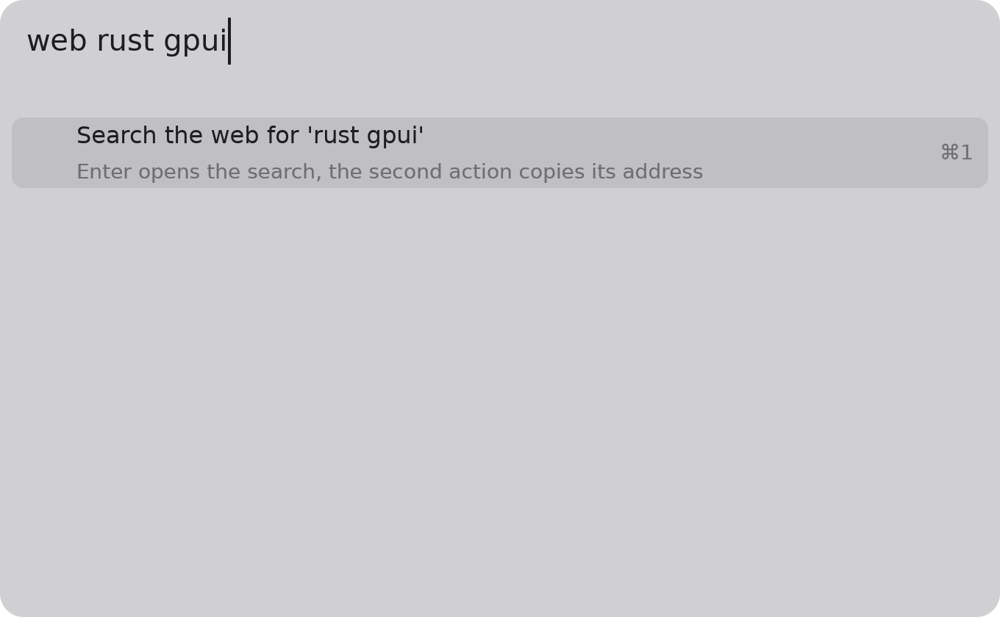
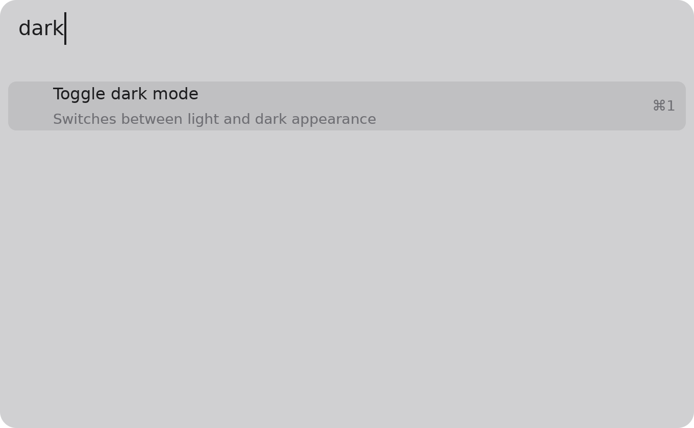
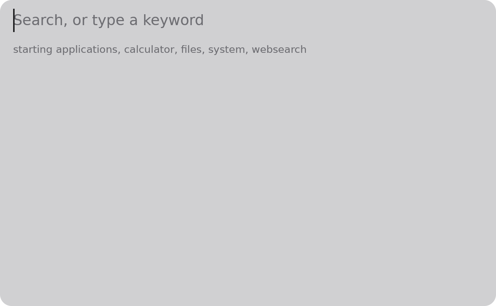

# Everyday use

{ width="640" }

## Keys

| Keys | What they do |
|---|---|
| ++option+space++ | Show the launcher, or hide it if it is showing |
| Typing | Asks every plugin that answers the text, as you type |
| ++up++ / ++down++ | Move the selection; the list scrolls past seven rows |
| ++enter++ | Run the selected row |
| ++cmd+1++ to ++cmd+9++ | Run the first to ninth row on screen |
| ++escape++ | Hide the launcher (or cancel what an input method is composing) |
| ++cmd+backspace++ | Clear the input |
| ++option+backspace++ | Delete the word before the cursor |
| ++left++ / ++right++, with ++shift++ | Move the cursor, and select |
| ++cmd+a++, ++cmd+c++, ++cmd+v++ | Select all, copy, paste |

The launcher hides itself when you click elsewhere.

## Keywords

Some plugins answer only when the text starts with their keyword, so they stay out of the
way otherwise: `web` searches the web, `f` finds files. Others answer anything they
understand: the calculator answers arithmetic, the system plugin answers `sleep`, `lock`,
`trash` and `dark`.

{ width="640" }

## The line under the input

A single line under the input says what is going on: a plugin's error, which plugins are
still answering, or which are still starting.

{ width="640" }

!!! abstract "To be written"
    Every key, mouse use, and what each message means. Tracked by the documentation epic
    (TASK-1.43).
